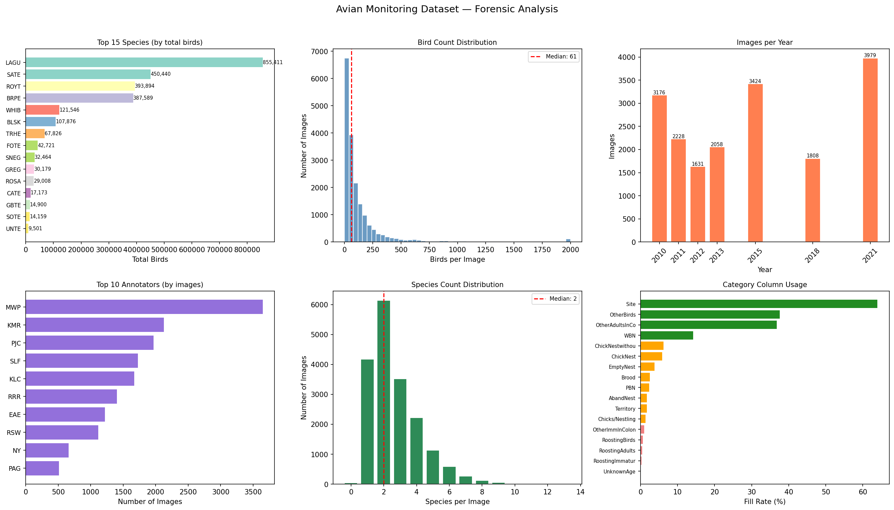
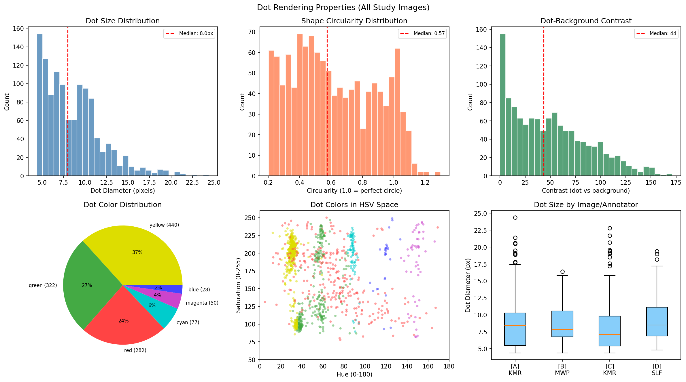
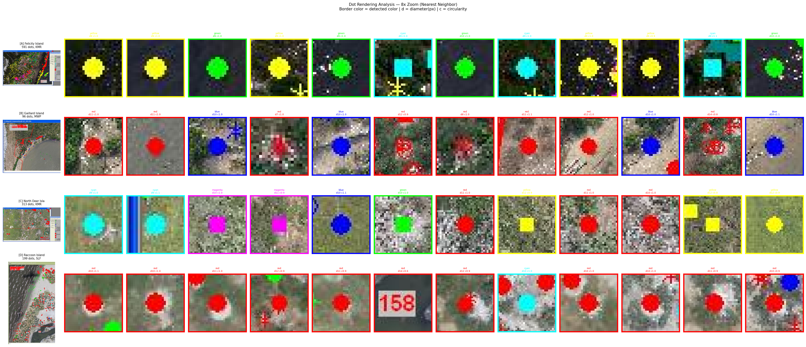
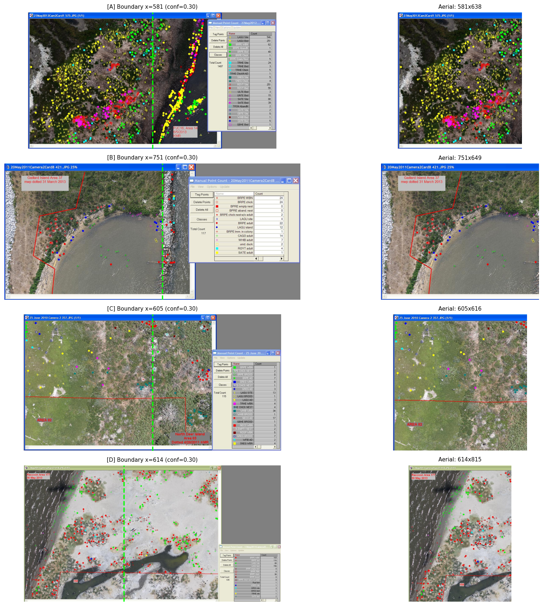
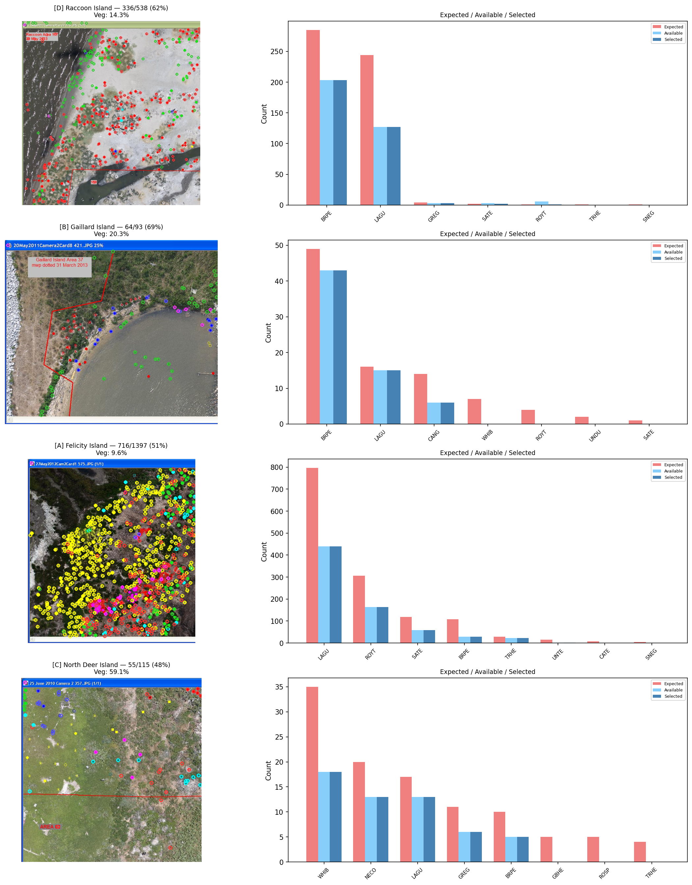
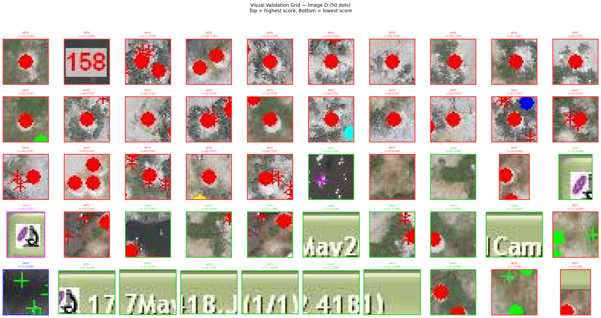
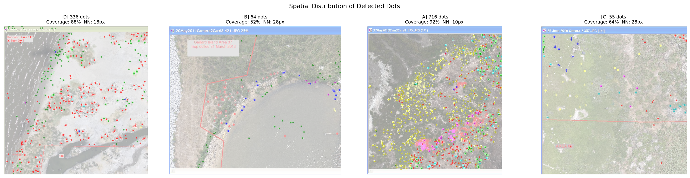
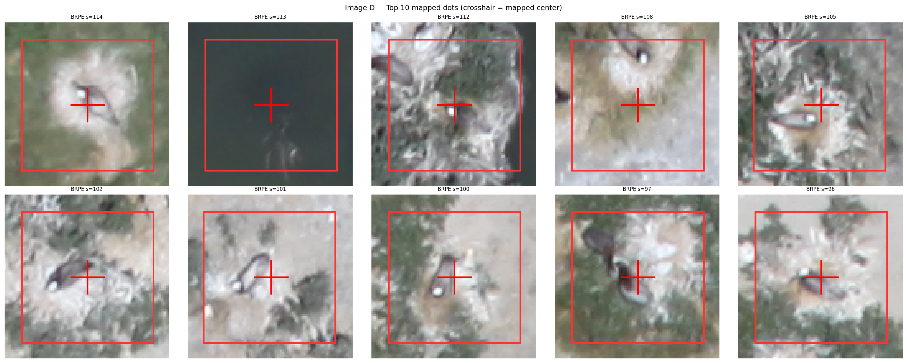
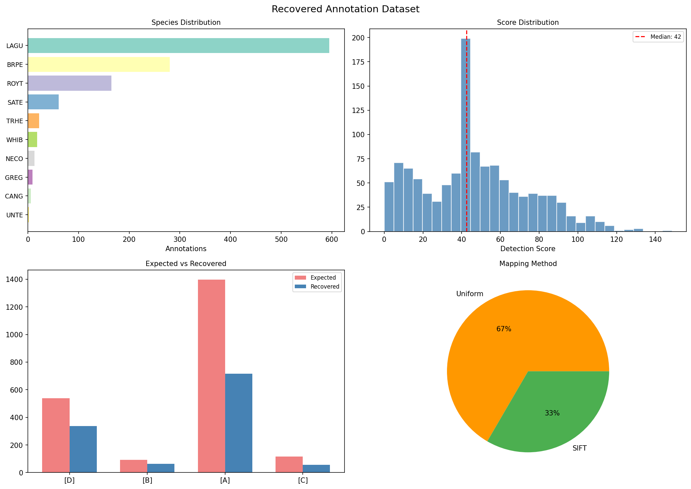

> This project is developed as part of [Google Summer of Code 2026](https://summerofcode.withgoogle.com/), mentored by DeepForest.
# Recovering Bird Annotations from Historical Airborne Imagery
Prototype for recovering ML-ready annotations from 18,304 historical bird survey screenshots where colored dots were baked directly into images by a point-counting tool. No coordinate data was saved. This prototype extracts dot positions, maps them to original high-resolution photographs, and produces DeepForest-compatible training data.

Data source: twi-aviandata.s3.amazonaws.com (Gulf of Mexico avian monitoring, 2010-2021, post-Deepwater Horizon)

---
## About This Work
This prototype was built over 1.5 months under the mentorship of my uncle and guidance from past GSoC contributors who guided me through the open-source contribution process and research. Before writing any pipeline code, I spent two weeks studying the data — mapping 533K files in the S3 bucket, analyzing 49,204 CSV rows across 60 columns, downloading and measuring 25 diverse images, and testing existing models (SAM 3, DeepForest, GroundingDINO) to understand what was feasible.
The pipeline went through five detector versions, four training experiments, and six approaches that were tested and abandoned. Every failure is documented with root cause analysis. 
The biggest lesson: study the data before building. 40% of my time was measurement and analysis. Every measured parameter directly informed a pipeline design decision. Detection accuracy jumped from 44% (first version, guessed parameters) to 70.8% (final version, measured parameters) without changing the fundamental approach.

---
## Pipeline Output

### The Problem: Annotations Baked Into Screenshots

Four study images spanning the difficulty range. Left: screenshots with colored dots baked in by the counting tool. Right: original high-resolution photographs (no annotations). The pipeline recovers dot positions from the left and maps them to coordinates on the right.

### Dataset Analysis (49,204 Rows)

LAGU (Laughing Gull) dominates at 855K birds. Median image has 61 birds. 18 annotators across 7 years and 5 Gulf Coast states. Every number here informed a pipeline parameter.

### Measured Dot Properties

Dot diameter 8.0px median, 6 distinct annotation colors, circularity 0.57. Measured from 1,199 candidate dots across all study images. These measurements set the detection thresholds — nothing was guessed.

### Dots at 8x Zoom

Individual annotation dots at 8x magnification showing actual pixel-level rendering. Red, yellow, green, cyan, blue, and magenta dots are clearly distinct from background at this scale.

### Screenshot Decomposition

3-method consensus boundary detection (grey profile + Sobel edges + color variance) reliably separates the aerial photograph from the dialog box across all screenshot formats.

### Detection Results (4 Study Images)

Detection on 4 study images (deliberately hard cases): D: 62%, B: 69%, A: 51%, C: 48%. Left: detected dots overlaid on aerial. Right: expected vs available vs selected per species. Batch of 30 random images achieves 70.8% overall.

### Validation: Are These Real Dots?

50 detected dots at 6x zoom from Image D. Top rows (high score): clearly real annotation dots with bright red centers. Bottom rows (low score): includes text watermark false positives ("17", "7Ma", etc.) — this is exactly why the text filter was disabled. Birds sitting in colony rows look like text to the algorithm.

### Spatial Distribution

Detected dots spread across aerial images, not clustered in one area. Coverage ranges from 52-92% of the 5x5 spatial grid per image.

### Coordinate Mapping (Screenshot to Original)

Left: dots on screenshot. Right: dots mapped to original high-resolution image. D and C use SIFT homography (0.5px accuracy). B and A use uniform height-based scaling (fallback when SIFT fails).

### Mapped Dots Verification (Zoomed)

Top 10 mapped dots on original image at high zoom. Red crosshairs mark the mapped center. Bounding boxes show the annotation region. Birds visible at mapped locations.

### Exported Dataset

3,915 recovered annotations across 21 species in DeepForest CSV format. Species distribution, score distribution, per-image counts, and mapping method breakdown.

### Training Experiment: Full Circle

The complete pipeline story on one image: (1) corrupted screenshot with baked-in dots, (2) 64/93 dots recovered at 69% accuracy, (3) pretrained DeepForest produces 2 high-confidence detections, (4) fine-tuned model — this panel shows the bfloat16-corrupted run (300 false detections at score 1.0). Root cause identified and fixed in subsequent experiments. See [training analysis](docs/training_analysis.md).

### Training Experiment: SIFT-Only (Root Cause Fix)

Training only on SIFT-mapped images (0.5px position accuracy, 920 annotations) produced the only improvement over pretrained: +29% max score, 0 to 1 high-confidence detection. This confirmed that position accuracy — not data quantity — drives training quality. With 76% fewer annotations but accurate positions, the model improved. With the full dataset (including ~30px position errors), it got worse.

## Results

| Metric | Value |
|--------|-------|
| Images processed | 34 (0 crashes) |
| Detection accuracy | 70.8% |
| Precision | 98.3% |
| False positive rate | 1.7% |
| Annotations recovered | 3,915 |
| Species detected | 21 |
| SIFT mapping success | 57% (0.5px error) |
| SAM 3 habitat classification | 97% |
| Scene captions generated | 34 |
| Processing speed | 11 sec/image |
| Estimated full dataset recovery | ~340,000 annotations |

## What didn't work (and why)

| Approach | Result |
|----------|--------|
| OCR on dialog box | 4-15% precision |
| Dialog color clusters | 8% accuracy | 
| Narrow HSV bins | 44% accuracy | 
| Text watermark filter | Removed real dots | 
| Training on full dataset | 0 high-conf detections |
| Species-aware boxes | Made it worse | 

## Pipeline
Screenshot → Decompose → Detect Dots → Validate → Map → Export

1. **Screenshot Decomposition** — 3-method consensus boundary detection
2. **Dot Detection** — Wide HSV bins, vegetation-adaptive thresholds, count-guided selection from CSV
3. **Validation** — 98.3% of detected dots land on high-saturation pixels
4. **Coordinate Mapping** — SIFT homography (0.5px) with uniform fallback (height-based)
5. **SAM 3 Integration** — Bird validation, habitat classification, scene captioning
6. **Export** — DeepForest-compatible CSV with train/test split

## Key Findings

- CSV ground truth is 100% accurate — OCR abandoned after testing
- Wide HSV bins outperform narrow and adaptive approaches
- Birds in colony rows resemble text — text filter disabled
- Uniform scale_x is wrong — use scale_y for both axes
- bfloat16 from SAM 3 silently corrupts DeepForest training
- Position accuracy matters more than box size or data quantity
- Full list: [docs/learnings.md](docs/learnings.md)
- Training details: [docs/training_analysis.md](docs/training_analysis.md)

## Repository Structure
notebook/prototype_v1.ipynb — Complete prototype, 23 sections, runs in Colab
results/ — All output figures, metrics (JSON), annotations (CSV)
docs/learnings.md — 21 documented learnings
docs/training_analysis.md — 4 training experiments with root cause analysis

## Quick Start

Open `notebook/prototype_v1.ipynb` in Google Colab. Set runtime to T4 GPU. Run all cells top to bottom (~45 minutes).

## Dataset

Source: twi-aviandata.s3.amazonaws.com — 18,304 annotated screenshots, 49,204 CSV rows, 102 species, 18 annotators, 442 colonies, 7 years (2010-2021), 5 Gulf Coast states.

Full list of learnings: [docs/learnings.md](docs/learnings.md)

Training experiment details: [docs/training_analysis.md](docs/training_analysis.md)
